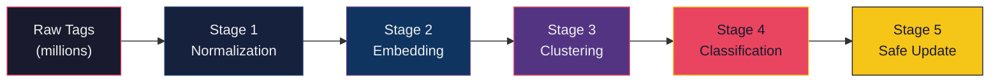
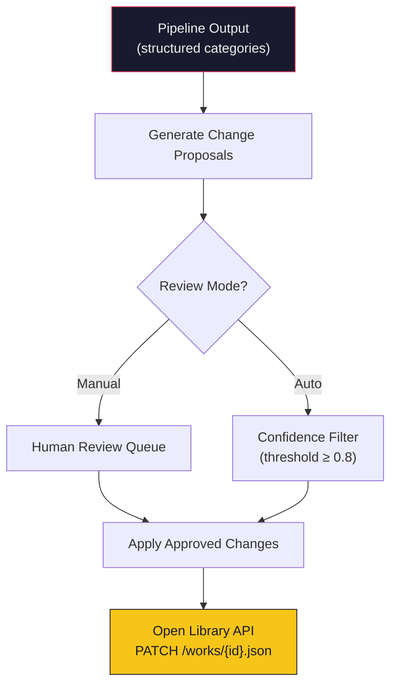
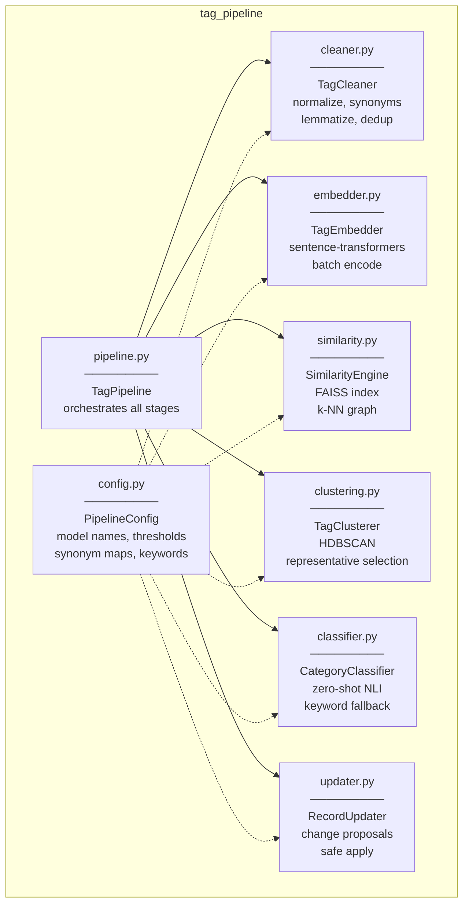

# System Architecture: Tag Normalization & Semantic Classification Pipeline

## Open Library — Google Summer of Code

A scalable pipeline to process millions of messy book subject tags from Open Library records, normalize them, detect semantic relationships, cluster related concepts, and map them into structured metadata categories.

---

## High-Level Pipeline Flow



---

## Stage 1 — Tag Normalization

### Purpose

Convert raw, messy tags into a canonical form so that trivially different variants collapse into a single representation *before* any expensive similarity computation.

### Operations (in order)

| Step | Operation | Example |
|------|-----------|---------|
| 1 | Unicode NFKD normalization | `"café"` → `"cafe"` |
| 2 | Lowercase | `"Science Fiction"` → `"science fiction"` |
| 3 | Strip accents and diacritics | `"naïve"` → `"naive"` |
| 4 | Replace hyphens/underscores with spaces | `"science-fiction"` → `"science fiction"` |
| 5 | Remove all non-alphanumeric except spaces | `"A.I."` → `"ai"` |
| 6 | Collapse whitespace | `"sci  fi"` → `"sci fi"` |
| 7 | Apply synonym/abbreviation map | `"scifi"` → `"science fiction"` |
| 8 | Optional lemmatization (spaCy) | `"adventures"` → `"adventure"` |
| 9 | Deduplicate | Remove exact post-normalization duplicates |

### Synonym Map Strategy

A curated dictionary maintained as a JSON/YAML file mapping known abbreviations and slang to their canonical forms. This map grows over time as new variants are discovered during processing.

### Recommended Libraries

- **`unicodedata`** (stdlib) — Unicode normalization and accent stripping
- **[re](file:///c:/Users/Adi%20Rajput/Desktop/coderobot/tag_pipeline/clustering.py#7-57)** (stdlib) — Regex-based punctuation and whitespace handling
- **`spaCy`** (`en_core_web_sm`) — Optional lemmatization for high-accuracy normalization

### Why This Works at Scale

Every operation is **O(n)** per tag. Synonym lookup is a hash-map operation (**O(1)**). This stage reduces the tag vocabulary significantly before the expensive embedding and clustering stages, which is critical when processing millions of records.

---

## Stage 2 — Semantic Similarity via Embeddings

### Purpose

Map each *unique normalized tag* into a dense vector space so that semantically related tags (e.g., `"artificial intelligence"` and `"machine learning"`) land near each other, even when they share no surface-level words.

### Approach: Sentence Transformers

Use a pre-trained sentence transformer model to encode each tag into a fixed-dimensional dense vector.

| Model | Dimensions | Speed | Quality | Use Case |
|-------|-----------|-------|---------|----------|
| `all-MiniLM-L6-v2` | 384 | ★★★★★ | ★★★★ | **Default — best speed/quality ratio** |
| `all-mpnet-base-v2` | 768 | ★★★ | ★★★★★ | Higher accuracy if compute allows |
| `paraphrase-MiniLM-L3-v2` | 384 | ★★★★★★ | ★★★ | Maximum throughput, slight quality dip |

### Why Embeddings Over String Similarity

| Method | Catches `scifi ↔ science fiction`? | Catches `AI ↔ artificial intelligence`? | Catches `dystopian ↔ post-apocalyptic`? |
|--------|:---:|:---:|:---:|
| Levenshtein / edit distance | ❌ | ❌ | ❌ |
| Character n-gram TF-IDF | ✅ | ❌ | ❌ |
| Fuzzy matching (rapidfuzz) | ✅ | ❌ | ❌ |
| **Sentence embeddings** | ✅ | ✅ | ✅ |

String-level methods fail on semantic similarity. Embeddings capture *meaning*, which is essential for a book catalog where tags like `"coming of age"` and `"bildungsroman"` must be recognized as related.

### Approximate Nearest Neighbor Search with FAISS

For millions of tags, computing a full N×N similarity matrix is infeasible. Instead:

1. Encode all unique tags into vectors.
2. Build a **FAISS index** (`IndexIVFFlat` or `IndexHNSWFlat`) over the vectors.
3. For each tag, query the **top-k nearest neighbors** (k ≈ 20–50).
4. Construct a **sparse similarity graph** from the neighbor lists.

This reduces similarity computation from **O(n²)** to approximately **O(n × k × log n)**.

### Recommended Libraries

- **`sentence-transformers`** — Encoding tags into dense vectors
- **`faiss-cpu`** (or `faiss-gpu`) — Approximate nearest neighbor search
- **`numpy`** — Vector arithmetic

### Batch Processing Strategy

```
┌─────────────────────────────────────────────┐
│  Unique normalized tags (e.g., 500K)        │
├─────────────────────────────────────────────┤
│  Encode in batches of 4096                  │
│  → sentence_model.encode(batch)             │
│  → Stack into (N, 384) matrix               │
├─────────────────────────────────────────────┤
│  Build FAISS index on full matrix            │
│  → index = faiss.IndexHNSWFlat(384, 32)     │
│  → index.add(embeddings)                    │
├─────────────────────────────────────────────┤
│  Query k-NN for each vector                 │
│  → distances, indices = index.search(X, k)  │
│  → Build sparse adjacency graph             │
└─────────────────────────────────────────────┘
```

---

## Stage 3 — Clustering

### Purpose

Group semantically related tags into clusters where each cluster represents a single underlying concept (e.g., all variations of "science fiction" in one cluster).

### Algorithm: HDBSCAN

| Property | Why It Matters |
|----------|---------------|
| No predefined cluster count | We don't know how many concepts exist in advance |
| Density-based | Naturally handles noise — rare/unusual tags won't force bad clusters |
| Hierarchical | Produces a cluster tree, allowing exploration at different granularities |
| Soft clustering available | Tags can have fractional membership across clusters |
| Scales well | O(n log n) with optimizations |

### Configuration

```
min_cluster_size = 2       (even two related tags should form a cluster)
min_samples = 1            (allow small clusters for rare but valid concepts)
metric = "euclidean"       (on embedding vectors)
cluster_selection_method = "eom"   (excess of mass — favors stability)
```

### Cluster Representative Selection

For each cluster, select the **representative tag** — the tag closest to the cluster centroid in embedding space:

1. Compute the mean vector of all tag embeddings in the cluster.
2. The tag whose embedding has the highest cosine similarity to the mean is the representative.

This is more robust than heuristics like "pick the longest tag" because it selects the most *semantically central* term.

### Post-Clustering Merge Pass

After initial clustering, run a merge pass:
- Compute centroid-to-centroid similarity between all clusters.
- Merge clusters with centroid similarity > 0.85 threshold.
- This catches cases where HDBSCAN splits a concept into sub-clusters.

### Recommended Libraries

- **`hdbscan`** — The HDBSCAN algorithm implementation
- **`numpy`** — Centroid computation and vector operations

---

## Stage 4 — Semantic Category Classification

### Purpose

Assign each cluster to one or more structured categories: **Genre**, **Theme**, **Setting**, **Mood**, **Audience**.

### Two-Tier Classification Strategy

#### Tier 1: Zero-Shot NLI Classification (Primary)

Use a pre-trained Natural Language Inference model to classify cluster representatives against candidate category labels *without any training data*.

**How it works:**
- Frame it as: "Does `[tag]` entail `[category description]`?"
- Feed the representative tag as the *premise* and category descriptions as *hypotheses*.
- The model scores each hypothesis; highest score wins.

**Candidate hypotheses:**

```
genre:    "This is a literary genre or type of fiction/nonfiction"
theme:    "This is a thematic subject, concept, or idea explored in literature"
setting:  "This describes a physical location, time period, or world"
mood:     "This describes an emotional tone, atmosphere, or feeling"
audience: "This describes a target readership or age group"
```

| Model | Speed | Quality |
|-------|-------|---------|
| `facebook/bart-large-mnli` | ★★★ | ★★★★★ |
| `MoritzLaurer/DeBERTa-v3-base-mnli` | ★★★★ | ★★★★★ |
| `typeform/distilbert-base-uncased-mnli` | ★★★★★ | ★★★★ |

#### Tier 2: Keyword Rule Engine (Fallback)

For tags where zero-shot confidence is below a threshold (< 0.4), fall back to a curated keyword dictionary:

```
genre_keywords   = ["fiction", "mystery", "romance", "fantasy", "horror", ...]
theme_keywords   = ["intelligence", "war", "love", "identity", "freedom", ...]
setting_keywords = ["space", "ocean", "medieval", "city", "dystopian", ...]
mood_keywords    = ["dark", "hopeful", "suspenseful", "whimsical", ...]
audience_keywords = ["young adult", "children", "academic", "professional", ...]
```

The keyword engine scans the tag for substring matches against each category's keyword list.

### Why Two Tiers?

- Zero-shot classification captures **semantic intent** — it knows that `"bildungsroman"` is a genre even though it matches no simple keyword.
- The keyword fallback handles **extremely common, obvious cases** cheaply and provides a safety net if the NLI model is uncertain.
- Together they achieve near-complete coverage.

### Multi-Label Support

A single tag can belong to multiple categories. For example:
- `"dystopian"` → **genre** (dystopian fiction) + **setting** (dystopian world) + **mood** (bleak)

The classifier returns all categories above the confidence threshold.

---

## Stage 5 — Safe Record Update Mechanism

### Purpose

Modify Open Library book records to include structured category metadata without losing or corrupting existing data.

### Strategy: Diff-Based Proposals



### Change Proposal Format

Each proposed change is a structured record:

```json
{
    "work_id": "OL12345W",
    "original_subjects": ["scifi", "Sci-Fi", "space opera", "AI"],
    "proposed_structured": {
        "genre": ["science fiction"],
        "themes": ["artificial intelligence"],
        "setting": ["space"]
    },
    "action": "enrich",
    "confidence": 0.91,
    "preserve_originals": true,
    "timestamp": "2026-03-16T12:00:00Z"
}
```

### Safety Rules

| Rule | Purpose |
|------|---------|
| **Never delete original subjects** | Original tags are preserved as-is in a `raw_subjects` field |
| **Append-only structured fields** | New `structured_subjects` field is added alongside originals |
| **Confidence gating** | Only apply changes with aggregate confidence ≥ 0.8 automatically |
| **Batch size limits** | Process in batches of 1000 records with checkpoints |
| **Dry-run mode** | Generate proposals without applying, for human review |
| **Rollback log** | Every change writes a before/after snapshot to a changelog |

---

## Stage 6 — Scalable Data Processing Architecture

### Batch Processing Pipeline


### Key Design Decisions

| Decision | Rationale |
|----------|-----------|
| **Parquet for storage** | Columnar format, excellent compression, supports chunked reading |
| **Global tag registry** | Deduplicate across all records — embed each unique tag exactly once |
| **Chunked processing** | Memory-safe iteration over millions of records |
| **Checkpoint system** | Resume from last successful chunk on failure |
| **Separate embed + cluster** | Embedding is parallelizable; clustering needs the full matrix |

### Scale Estimates

| Metric | Estimate |
|--------|----------|
| Total Open Library works | ~35 million |
| Works with subjects | ~20 million |
| Total subject tag instances | ~100 million |
| **Unique tags after normalization** | **~2–5 million** |
| Embedding time (MiniLM, CPU, batch 4096) | ~8–12 hours for 5M tags |
| Embedding time (MiniLM, GPU) | ~1–2 hours for 5M tags |
| FAISS index build (5M × 384d) | ~10 minutes |
| HDBSCAN clustering | ~30–60 minutes |
| Full pipeline (CPU) | ~12–16 hours |
| Full pipeline (GPU) | ~3–5 hours |

### Recommended Libraries

- **`pyarrow`** / **`pandas`** — Parquet I/O and chunked data processing
- **`faiss-cpu`** or **`faiss-gpu`** — Approximate nearest neighbor at scale
- **`joblib`** — Parallel batch encoding
- **`tqdm`** — Progress tracking across batches

---

## Module Architecture



### Module Contracts

Each module exposes a single primary class with a clear interface:

| Module | Class | Key Method | Input | Output |
|--------|-------|-----------|-------|--------|
| [cleaner.py](file:///c:/Users/Adi%20Rajput/Desktop/coderobot/tag_pipeline/cleaner.py) | [TagCleaner](file:///c:/Users/Adi%20Rajput/Desktop/coderobot/tag_pipeline/cleaner.py#8-44) | [clean(tags)](file:///c:/Users/Adi%20Rajput/Desktop/coderobot/tag_pipeline/cleaner.py#13-22) | `list[str]` | `list[str]` |
| `embedder.py` | `TagEmbedder` | `encode(tags)` | `list[str]` | `np.ndarray (N×D)` |
| [similarity.py](file:///c:/Users/Adi%20Rajput/Desktop/coderobot/tag_pipeline/similarity.py) | [SimilarityEngine](file:///c:/Users/Adi%20Rajput/Desktop/coderobot/tag_pipeline/similarity.py#9-81) | `build_graph(embeddings)` | `np.ndarray` | sparse adjacency |
| [clustering.py](file:///c:/Users/Adi%20Rajput/Desktop/coderobot/tag_pipeline/clustering.py) | [TagClusterer](file:///c:/Users/Adi%20Rajput/Desktop/coderobot/tag_pipeline/clustering.py#7-57) | [cluster(tags, embeddings)](file:///c:/Users/Adi%20Rajput/Desktop/coderobot/tag_pipeline/clustering.py#11-36) | `list[str]`, `np.ndarray` | `list[Cluster]` |
| `classifier.py` | `CategoryClassifier` | [classify(clusters)](file:///c:/Users/Adi%20Rajput/Desktop/coderobot/tag_pipeline/category_mapper.py#9-27) | `list[Cluster]` | `dict[str, list]` |
| `updater.py` | `RecordUpdater` | `propose(work, categories)` | work record, categories | `ChangeProposal` |
| [pipeline.py](file:///c:/Users/Adi%20Rajput/Desktop/coderobot/tag_pipeline/pipeline.py) | [TagPipeline](file:///c:/Users/Adi%20Rajput/Desktop/coderobot/tag_pipeline/pipeline.py#34-84) | [process(tags)](file:///c:/Users/Adi%20Rajput/Desktop/coderobot/tag_pipeline/pipeline.py#42-84) | `list[str]` | [PipelineResult](file:///c:/Users/Adi%20Rajput/Desktop/coderobot/tag_pipeline/pipeline.py#10-32) |

---

## Technology Summary

| Layer | Tool / Library | Purpose |
|-------|---------------|---------|
| Normalization | `unicodedata`, [re](file:///c:/Users/Adi%20Rajput/Desktop/coderobot/tag_pipeline/clustering.py#7-57), `spaCy` | Text cleaning, lemmatization |
| Embeddings | `sentence-transformers` | Semantic vectorization |
| ANN Search | `faiss` | Scalable nearest-neighbor |
| Clustering | `hdbscan` | Density-based grouping |
| Classification | `transformers` (zero-shot) | Semantic category assignment |
| Data Layer | `pyarrow`, `pandas` | Parquet I/O, chunked processing |
| Parallelism | `joblib`, `tqdm` | Batch parallelism, progress |
| Config | `pydantic` | Validated configuration |
| CLI / Demo | `rich`, `typer` | Beautiful terminal output |

---

## Why This Architecture

1. **Embeddings over string matching** — Captures semantic relationships that surface-level methods completely miss. Essential for a catalog where `"bildungsroman"` and `"coming of age"` must be linked.

2. **FAISS over brute-force similarity** — Makes the system feasible at 5M+ tags. Brute-force is O(n²); FAISS gives O(n log n) approximate answers with negligible quality loss.

3. **HDBSCAN over K-Means** — No need to guess the number of clusters. Handles noise gracefully. Produces clusters of varying sizes, which matches the real distribution of book tags.

4. **Zero-shot NLI over fine-tuning** — No labeled training data required. Works immediately on any new tag category. Can be swapped for a fine-tuned model later as labeled data accumulates.

5. **Diff-based updates over direct writes** — Preserves all original metadata. Every change is auditable. Supports both human review and automatic application with confidence gating.

6. **Parquet + chunked processing over in-memory** — Handles datasets that don't fit in RAM. Supports resumable processing. Standard format that integrates with any data tooling.

7. **Modular design** — Each stage can be tested, benchmarked, and replaced independently. Swap `MiniLM` for `mpnet` without touching the clustering code. Replace HDBSCAN with agglomerative clustering by implementing the same interface.
